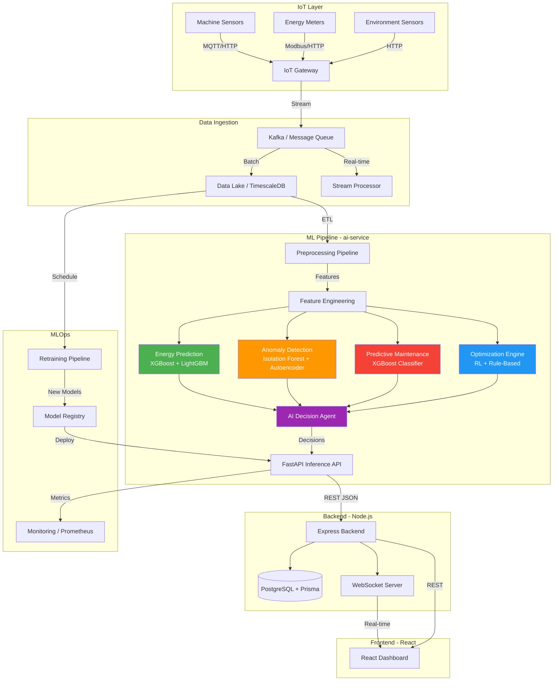
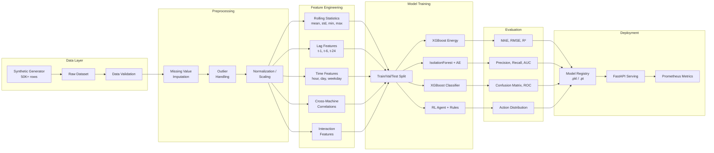
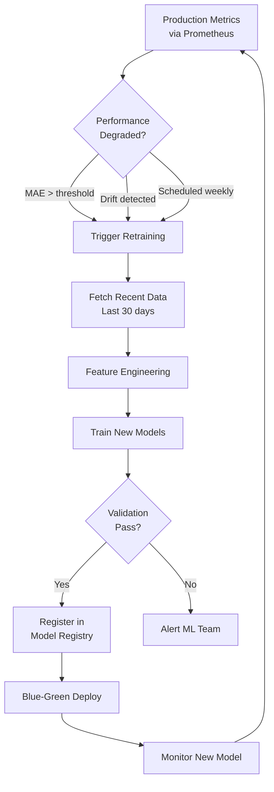

# NEXOVA AI Platform — System Architecture

## Overview

NEXOVA is a B2B AI + IoT platform that optimizes industrial energy consumption, detects anomalies, predicts failures, and autonomously recommends actions. The ML subsystem is designed as a standalone microservice that integrates with the Node.js backend via REST API.

---

## 1. High-Level Architecture



---

## 2. Model Interaction Diagram

```mermaid
sequenceDiagram
    participant Client as Node.js Backend
    participant API as FastAPI Gateway
    participant IE as Inference Engine
    participant EM as Energy Model
    participant AD as Anomaly Detector
    participant PM as Predictive Maintenance
    participant OPT as Optimization Engine
    participant AGT as AI Decision Agent

    Client->>API: POST /ai-decision {sensor_data}
    API->>IE: route_request(data)
    
    par Parallel Model Inference
        IE->>EM: predict_energy(features)
        EM-->>IE: energy_forecast
        IE->>AD: detect_anomaly(features)
        AD-->>IE: anomaly_result
        IE->>PM: predict_failure(features)
        PM-->>IE: failure_probability
        IE->>OPT: recommend_actions(features)
        OPT-->>IE: optimization_actions
    end
    
    IE->>AGT: aggregate_decisions(all_results)
    AGT->>AGT: compute_risk_score()
    AGT->>AGT: estimate_cost_savings()
    AGT->>AGT: generate_recommendations()
    AGT-->>IE: final_decision
    IE-->>API: structured_response
    API-->>Client: JSON {decision, risk, savings, actions}
```

---

## 3. ML Pipeline Flow



---

## 4. Model Details

| Model | Type | Algorithm | Input | Output | Metrics |
|-------|------|-----------|-------|--------|---------|
| Energy Prediction | Regression | XGBoost + LightGBM | sensor features + time features | kWh next hour | MAE, RMSE, R² |
| Anomaly Detection | Unsupervised | Isolation Forest + Autoencoder | sensor features (scaled) | anomaly score 0-1 | Precision, Recall, F1, AUC |
| Predictive Maintenance | Classification | XGBoost Classifier | sensor + runtime + lag features | failure probability | Accuracy, F1, ROC-AUC |
| Optimization Engine | RL / Rules | Q-Learning + Domain Rules | all sensor features + model outputs | action recommendations | Reward convergence |

---

## 5. Data Flow & Feature Engineering

### Raw Features (from IoT sensors)
- `temperature` — Machine operating temperature (°C)
- `vibration` — Vibration level (mm/s)
- `power_consumption` — Current power draw (kW)
- `voltage` — Supply voltage (V)
- `current` — Supply current (A)
- `runtime_hours` — Cumulative runtime
- `ambient_temperature` — Environment temperature (°C)
- `humidity` — Relative humidity (%)

### Engineered Features
- **Rolling statistics**: 1h, 6h, 24h rolling mean/std/min/max for power, temperature, vibration
- **Lag features**: Values at t-1, t-6, t-12, t-24
- **Delta features**: Rate of change over 1h, 6h windows
- **Time encodings**: hour_sin, hour_cos, day_of_week_sin, day_of_week_cos
- **Interaction features**: power × temperature, vibration × runtime
- **Cross-machine**: deviation from fleet average

---

## 6. Retraining Strategy



---

## 7. Folder Structure

```
ai-service/
├── config/
│   └── settings.py                  # Centralized configuration
├── data/                            # Generated datasets (gitignored)
├── pipeline/
│   ├── __init__.py
│   ├── data_generator.py            # 50K+ row synthetic data
│   ├── feature_engineering.py       # Feature transformations
│   ├── preprocessing.py             # Cleaning & normalization
│   └── training/
│       ├── __init__.py
│       ├── energy_model.py          # XGBoost/LightGBM energy predictor
│       ├── anomaly_model.py         # Isolation Forest + Autoencoder
│       ├── maintenance_model.py     # XGBoost failure classifier
│       ├── optimization_model.py    # RL + rule-based optimizer
│       └── train_all.py             # Full training orchestrator
├── services/
│   ├── __init__.py
│   ├── inference_engine.py          # Unified inference dispatcher
│   └── ai_decision_agent.py         # Intelligent decision aggregator
├── models/
│   ├── schemas.py                   # Pydantic request/response models
│   └── trained/                     # Serialized model artifacts
├── main.py                          # FastAPI application
├── Dockerfile                       # Production container
├── requirements.txt                 # Python dependencies
└── ARCHITECTURE.md                  # This document
```
