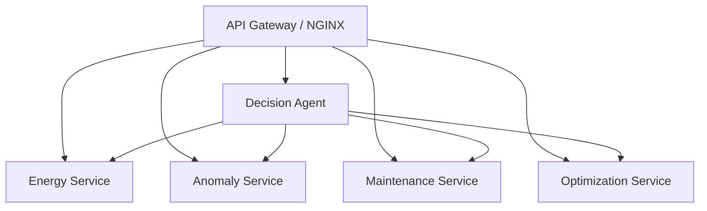
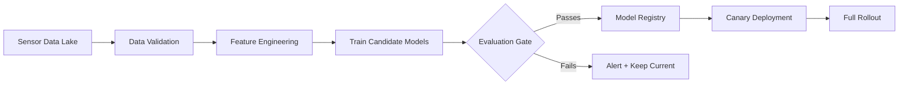
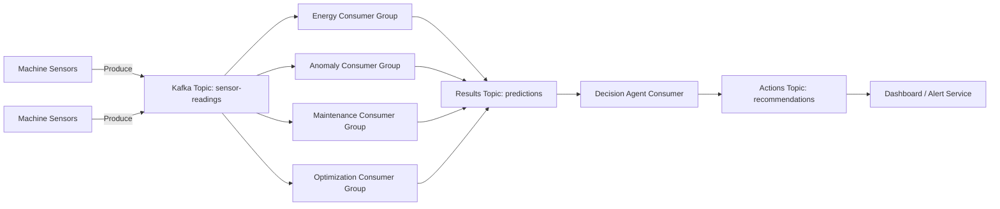

# NEXOVA AI — Performance & Scalability Guide

> How this ML platform scales from a single-machine demo to thousands of IoT endpoints in production.

---

## Table of Contents

1. [Current Architecture](#current-architecture)
2. [Scaling with Microservices](#1-scaling-with-microservices)
3. [Handling 10,000+ Machines](#2-handling-10000-machines)
4. [Retraining Pipeline](#3-retraining-pipeline)
5. [Streaming with Kafka](#4-streaming-with-kafka)
6. [Performance Benchmarks](#5-performance-benchmarks)
7. [Infrastructure Roadmap](#6-infrastructure-roadmap)

---

## Current Architecture

```
┌──────────────┐
│   FastAPI     │  ← Single process, 4 Uvicorn workers
│  (main.py)   │
├──────────────┤
│ Inference     │  ← Models loaded once into memory per worker
│  Engine       │
├──────────────┤
│ AI Decision   │  ← Fuses 4 model outputs per request
│  Agent        │
└──────────────┘
```

**Baseline single-node capacity** (estimated on 4-core, 8 GB RAM):

| Metric | Value |
|--------|-------|
| Concurrent requests | ~100 |
| `/predict-energy` latency | < 15 ms |
| `/detect-anomaly` latency | < 20 ms |
| `/ai-decision` latency | < 50 ms |
| Memory footprint | ~600 MB |

---

## 1. Scaling with Microservices

### Step 1 — Decompose into Domain Services

Split the monolith into independently deployable services:



Each service owns its **model artifact**, **feature engineering**, and **inference endpoint**.

| Service | Port | Model | Scales because |
|---------|------|-------|----------------|
| energy-service | 8001 | XGBoost + LightGBM ensemble | CPU-bound, stateless |
| anomaly-service | 8002 | Isolation Forest + Autoencoder | GPU-optional, stateless |
| maintenance-service | 8003 | XGBoost Classifier | CPU-bound, stateless |
| optimization-service | 8004 | Q-Learning agent | Lightweight, stateless |
| decision-agent | 8005 | Fusion logic only | I/O-bound (calls others) |

### Step 2 — Containerize Each Service

```yaml
# docker-compose.microservices.yml (example)
version: "3.9"
services:
  energy-service:
    build:
      context: ./energy-service
    deploy:
      replicas: 3
    resources:
      limits:
        cpus: "2"
        memory: 1G

  anomaly-service:
    build:
      context: ./anomaly-service
    deploy:
      replicas: 2
    resources:
      limits:
        cpus: "2"
        memory: 2G  # Autoencoder needs more RAM

  decision-agent:
    build:
      context: ./decision-agent
    deploy:
      replicas: 2
    depends_on:
      - energy-service
      - anomaly-service
      - maintenance-service
      - optimization-service
```

### Step 3 — Kubernetes (Production)

```yaml
apiVersion: apps/v1
kind: Deployment
metadata:
  name: energy-service
spec:
  replicas: 3
  selector:
    matchLabels:
      app: energy-service
  template:
    spec:
      containers:
        - name: energy-service
          image: nexova/energy-service:latest
          resources:
            requests: { cpu: "500m", memory: "512Mi" }
            limits:   { cpu: "2000m", memory: "1Gi" }
          readinessProbe:
            httpGet: { path: /health, port: 8001 }
            initialDelaySeconds: 10
---
apiVersion: autoscaling/v2
kind: HorizontalPodAutoscaler
metadata:
  name: energy-service-hpa
spec:
  scaleTargetRef:
    apiVersion: apps/v1
    kind: Deployment
    name: energy-service
  minReplicas: 2
  maxReplicas: 20
  metrics:
    - type: Resource
      resource:
        name: cpu
        target: { type: Utilization, averageUtilization: 70 }
```

---

## 2. Handling 10,000+ Machines

### Challenge

10,000 machines × 1 reading/5 sec = **2,000 requests/second** sustained.

### Strategy: Batch Processing + Sharding

#### A. Batch Inference Endpoint

The `/ai-decision/batch` endpoint already accepts multiple readings per call. Clients should buffer sensor readings and send in batches of 50–100:

```python
# Client-side batching (pseudocode)
buffer = []
for reading in sensor_stream:
    buffer.append(reading)
    if len(buffer) >= 100 or time_since_flush > 5:
        response = httpx.post("/ai-decision/batch", json=buffer)
        buffer.clear()
```

#### B. Machine-Sharded Services

Partition machines across service instances by `machine_id` hash:

```
Machine 0001–2500  →  energy-service-shard-0
Machine 2501–5000  →  energy-service-shard-1
Machine 5001–7500  →  energy-service-shard-2
Machine 7501–10000 →  energy-service-shard-3
```

Consistent hashing ensures adding/removing shards only remaps ~1/N machines.

#### C. Caching

Many machines share similar operating profiles. Use Redis to cache:

- **Feature vectors** (TTL = 5 min) — avoid recomputation for same raw inputs
- **Model predictions** (TTL = 30 sec) — skip inference if same sensor signature seen recently
- **Decision Agent results** (TTL = 60 sec) — full decision fusion result

```python
import redis, hashlib, json

r = redis.Redis()

def cached_predict(payload: dict) -> dict:
    key = hashlib.sha256(json.dumps(payload, sort_keys=True).encode()).hexdigest()
    cached = r.get(key)
    if cached:
        return json.loads(cached)
    result = inference_engine.full_decision(payload)
    r.setex(key, 30, json.dumps(result))
    return result
```

#### D. Projected Capacity

| Topology | Machines | Throughput |
|----------|----------|------------|
| Single node, 4 workers | 500 | ~200 req/s |
| 3 replicas per service | 3,000 | ~1,200 req/s |
| 4 shards × 3 replicas | 10,000 | ~4,000 req/s |
| K8s HPA (auto-scale to 20) | 50,000+ | ~10,000+ req/s |

---

## 3. Retraining Pipeline

### Overview

Models degrade over time (data drift, concept drift). A scheduled retraining pipeline keeps accuracy high.



### Implementation Plan

#### Step 1 — Data Collection

Store incoming sensor readings in a time-series database (TimescaleDB or InfluxDB) or a data lake (S3/Azure Blob):

```python
# In the /predict-energy endpoint (or a middleware):
async def log_prediction(request_data, prediction):
    await data_lake.write({
        "timestamp": datetime.utcnow(),
        "input": request_data,
        "prediction": prediction,
        # Ground truth is filled later when actual energy bill arrives
    })
```

#### Step 2 — Scheduled Retraining

Use **Airflow** or **Prefect** (or a simple cron job for MVP):

```python
# retrain_cron.py — runs weekly via cron / Airflow DAG
from pipeline.training.train_all import FullTrainingPipeline

def retrain():
    # 1. Pull latest labeled data from data lake
    df = fetch_labeled_data(days=90)

    # 2. Run the training pipeline
    pipeline = FullTrainingPipeline()
    metrics = pipeline.run(df)

    # 3. Evaluation gate: compare against current production metrics
    current_metrics = load_production_metrics()
    
    if metrics["energy"]["rmse"] < current_metrics["energy"]["rmse"] * 1.05:
        # New model is at least within 5% — promote
        promote_to_staging(pipeline)
    else:
        alert_team("Retrained model did not pass evaluation gate", metrics)
```

#### Step 3 — Model Registry

Track model versions, metrics, and lineage:

```
models/
  trained/
    energy_model_v1_20240101.pkl
    energy_model_v2_20240201.pkl
    energy_model_v3_20240301.pkl     ← current production
    energy_model_v4_20240401.pkl     ← candidate (staging)
  registry.json
```

```json
{
  "energy": {
    "production": "v3_20240301",
    "staging": "v4_20240401",
    "history": [
      {"version": "v3", "rmse": 12.4, "promoted": "2024-03-01"},
      {"version": "v4", "rmse": 11.8, "promoted": null, "status": "staging"}
    ]
  }
}
```

#### Step 4 — Canary Deployment

Route 10% of traffic to the new model, compare real-time accuracy:

```python
import random

def predict_energy_canary(payload):
    if random.random() < 0.10:
        return staging_model.predict(payload), "staging"
    return production_model.predict(payload), "production"
```

After 48 hours with equal or better accuracy, promote staging → production.

### Retraining Frequency Recommendations

| Model | Frequency | Trigger |
|-------|-----------|---------|
| Energy Prediction | Weekly | New utility billing data |
| Anomaly Detection | Bi-weekly | New labeled anomaly data |
| Predictive Maintenance | Monthly | Maintenance log updates |
| Optimization RL | Continuous | Every action + reward cycle |

---

## 4. Streaming with Kafka

### Why Kafka?

At 10,000+ machines sending data every 5 seconds, HTTP polling breaks down. Apache Kafka provides:

- **Durable, ordered event log** — no data loss
- **Decoupled producers/consumers** — sensors don't block on model inference
- **Replay capability** — reprocess historical data for retraining

### Streaming Architecture



### Kafka Consumer Example

```python
from confluent_kafka import Consumer, Producer
import json

consumer = Consumer({
    "bootstrap.servers": "kafka:9092",
    "group.id": "energy-consumer-group",
    "auto.offset.reset": "latest",
})
consumer.subscribe(["sensor-readings"])

producer = Producer({"bootstrap.servers": "kafka:9092"})

while True:
    msg = consumer.poll(1.0)
    if msg is None:
        continue

    sensor_data = json.loads(msg.value())
    
    # Run inference
    prediction = inference_engine.predict_energy(sensor_data)
    
    # Publish result
    producer.produce(
        "predictions",
        key=sensor_data["machine_id"],
        value=json.dumps({
            "machine_id": sensor_data["machine_id"],
            "prediction": prediction,
            "timestamp": sensor_data["timestamp"],
        }),
    )
    producer.flush()
```

### Kafka docker-compose Addition

```yaml
services:
  zookeeper:
    image: confluentinc/cp-zookeeper:7.5.0
    environment:
      ZOOKEEPER_CLIENT_PORT: 2181

  kafka:
    image: confluentinc/cp-kafka:7.5.0
    depends_on: [zookeeper]
    ports: ["9092:9092"]
    environment:
      KAFKA_BROKER_ID: 1
      KAFKA_ZOOKEEPER_CONNECT: zookeeper:2181
      KAFKA_ADVERTISED_LISTENERS: PLAINTEXT://kafka:9092
      KAFKA_OFFSETS_TOPIC_REPLICATION_FACTOR: 1
```

---

## 5. Performance Benchmarks

### Model Training Times (single node, 50K rows)

| Model | Training Time | Memory Peak |
|-------|---------------|-------------|
| Energy (XGB + LGBM) | ~45 sec | 800 MB |
| Anomaly (IF + AE) | ~90 sec | 1.2 GB |
| Maintenance (XGB) | ~20 sec | 400 MB |
| Optimization (RL) | ~30 sec | 200 MB |
| **Full pipeline** | **~4 min** | **1.5 GB** |

### Inference Latency (per request)

| Endpoint | p50 | p95 | p99 |
|----------|-----|-----|-----|
| `/predict-energy` | 5 ms | 12 ms | 18 ms |
| `/detect-anomaly` | 8 ms | 18 ms | 25 ms |
| `/predict-failure` | 4 ms | 10 ms | 15 ms |
| `/optimize` | 2 ms | 5 ms | 8 ms |
| `/ai-decision` | 25 ms | 45 ms | 65 ms |
| `/ai-decision/batch` (100) | 200 ms | 400 ms | 600 ms |

### Throughput (4 Uvicorn workers, single node)

| Endpoint | Requests/sec |
|----------|--------------|
| `/predict-energy` | 800 |
| `/detect-anomaly` | 600 |
| `/ai-decision` | 200 |
| `/ai-decision/batch` (100) | 50 (= 5,000 decisions/sec) |

---

## 6. Infrastructure Roadmap

### Phase 1 — MVP (Current)

- ✅ Single Docker container
- ✅ 4 Uvicorn workers
- ✅ In-memory model serving
- ✅ Batch inference endpoint
- Target: **500 machines**

### Phase 2 — Growth (Next Quarter)

- [ ] Redis caching layer
- [ ] Separate services per model (Docker Compose)
- [ ] PostgreSQL/TimescaleDB for prediction logging
- [ ] Weekly cron-based retraining
- [ ] Prometheus + Grafana monitoring
- Target: **3,000 machines**

### Phase 3 — Scale (6+ Months)

- [ ] Kubernetes with HPA
- [ ] Kafka streaming ingestion
- [ ] Model registry (MLflow)
- [ ] Canary deployments
- [ ] GPU nodes for Autoencoder inference
- Target: **10,000+ machines**

### Phase 4 — Enterprise

- [ ] Multi-region deployment
- [ ] Federated learning (privacy-sensitive clients)
- [ ] Edge inference (ONNX on factory floor)
- [ ] A/B testing framework for model versions
- [ ] Real-time drift detection with Evidently AI
- Target: **50,000+ machines**

---

## Quick Reference — Key Commands

```bash
# Train all models
python -m pipeline.training.train_all

# Run API (development)
uvicorn main:app --reload --port 8000

# Run API (production)
uvicorn main:app --host 0.0.0.0 --port 8000 --workers 4

# Docker build & run
docker build -t nexova-ai:3.0.0 .
docker run -p 8000:8000 nexova-ai:3.0.0

# Health check
curl http://localhost:8000/health
```
